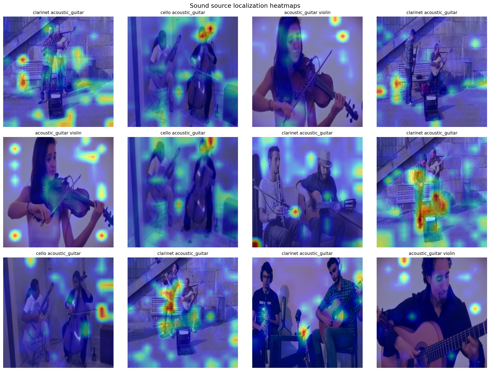

# Self-Supervised Audio-Visual Sound Localization

Localizing musical instruments in ensemble videos using a fully transformer-based cross-modal attention model. Given a video frame and the audio playing in it, the model predicts a heatmap over the frame showing *where* the sound is coming from — trained without any bounding-box supervision.

The pipeline is built on the [MUSIC dataset](https://github.com/roudimit/MUSIC_dataset) (solo + duet YouTube videos of 11 instruments) and uses a Mix-and-Localize style self-supervised objective: two solo clips are mixed into one waveform, and the model must still attend to the region of the frame corresponding to the target instrument.



## Architecture

No ResNet, no VGGish — both encoders are ViTs.

| Component | Model | In | Out |
|---|---|---|---|
| Visual encoder | `deit_small_patch16_224` (ImageNet pretrained, first 8 blocks frozen) | frame `(B, 3, 224, 224)` | 196 patch tokens `(B, 196, 384)` |
| Audio encoder | `vit_small_patch16_224` used AST-style on the log-mel spectrogram (1-channel, first 8 blocks frozen) | spectrogram `(B, 1, 128, T)` | global embedding `(B, 768)` |
| Cross-modal attention | single-head, audio query over visual keys/values (`proj_dim=256`) | tokens + embedding | heatmap `(B, 1, 224, 224)`, attention `(B, 196)` |

The 14×14 attention map is bilinearly upsampled to 224×224 to produce the localization heatmap.

### Training objective

`loss = L_loc + λ · L_contrast` (default `λ = 0.5`)

- **`L_loc` (`MixLocalizeLoss`)** — KL divergence between the attention distribution produced from the *solo* spectrogram (pseudo ground truth, no gradients) and the one produced from the *mixed* spectrogram. This supplies a real spatial gradient; a plain entropy objective on the mixed heatmap has no signal about *where* to peak and stays pinned at `log(224²) = 10.823`.
- **`L_contrast`** — InfoNCE over the batch between the audio embedding and the attention-weighted visual tokens, pulling matched audio-visual pairs together and pushing mismatched ones apart.

Training uses mixed precision, batch size 8 with 2 gradient accumulation steps (effective batch 16), AdamW, and a cosine LR schedule — sized to fit in 8 GB of VRAM.

## Repository layout

| File | Purpose |
|---|---|
| `data_pipeline_v2.py` | Downloads MUSIC videos with `yt-dlp`, extracts frames + 5 s waveforms with `ffmpeg`, splits by video ID (no clip leakage), writes `train/val/test.h5` |
| `music_dataset.py` | `MUSICDataset` — loads an HDF5 split, mixes each clip's waveform with a clip from a different instrument, returns `frame`, `mixed_spec`, `solo_spec` |
| `model.py` | `DeiTVisualEncoder`, `ASTAudioEncoder`, `CrossModalAttention`, `SoundSourceLocalizer` |
| `train.py` | Training/validation loop, losses, checkpointing to `checkpoints/best_model.pt` |
| `evaluate.py` | cIoU / AUC metrics and heatmap visualizations |
| `verify.py` | Sanity checks on the generated HDF5 files (shapes, silent audio, blank frames, class balance, dataloader smoke test) |
| `results/` | Committed evaluation output: `eval_results.json` and heatmap PNGs |

Raw videos are stored as `data/raw/<instrument>/<video_id>.mp4` and processed splits as `data/processed/{train,val,test}.h5`. Each HDF5 file holds `frames (N, 224, 224, 3)`, `waveforms (N, 80000)`, `labels`, `video_ids`, and `instruments`; spectrograms are computed at training time, *after* mixing.

Audio is 16 kHz, 5 s clips, 128 mel bins, `n_fft=400`, `hop_length=160`. Frames are 224×224, 10 clips per video.

## Setup

Requires Python 3.9+, plus `ffmpeg`/`ffprobe` and `yt-dlp` on your `PATH` for the data pipeline.

```bash
python -m venv .venv && source .venv/bin/activate
pip install torch torchvision timm h5py librosa numpy pillow tqdm scikit-learn matplotlib
```

A CUDA-capable GPU with ~8 GB of VRAM is recommended; everything falls back to CPU, just slowly.

## Usage

### 1. Build the dataset

```bash
git clone https://github.com/roudimit/MUSIC_dataset.git MUSICDataset

python data_pipeline_v2.py --music_repo MUSICDataset --output_dir ./data --max_per_instrument 20
python data_pipeline_v2.py --output_dir ./data --explore_only   # inspect the HDF5 files
python verify.py --data_dir ./data                              # sanity-check before training
```

Useful flags: `--clips_per_video`, `--skip_download`, `--skip_processing`. Note that some MUSIC videos are no longer available on YouTube, so download failures are expected and simply skipped. Raw videos can be deleted after processing (`rm -rf data/raw/`).

### 2. Train

`train.py` imports the dataset as `from dataset.music_dataset import MUSICDataset`, so place `music_dataset.py` in a `dataset/` package (`dataset/__init__.py` + `dataset/music_dataset.py`) or adjust the import to `from music_dataset import MUSICDataset`.

```bash
python train.py --data_dir ./data/processed --epochs 50 --batch_size 8 --accum_steps 2 --lr 1e-4
```

The best checkpoint by validation loss goes to `checkpoints/best_model.pt` and the per-epoch log to `checkpoints/history.json`.

### 3. Evaluate

```bash
python evaluate.py --data_dir ./data --checkpoint ./checkpoints/best_model.pt --visualize
```

Writes `results/eval_results.json` plus a heatmap grid and per-sample overlays to `results/`.

## Metrics

- **cIoU** — heatmap thresholded at 0.5, IoU against the ground-truth box.
- **AUC** — pixel-level ROC over all thresholds.

Evaluation currently uses a fixed central box `(45, 45, 179, 179)` as a stand-in for ground truth, since the MUSIC clips carry no localization annotations. The numbers below are therefore a proxy for "does the heatmap concentrate on the centre of the frame", not a benchmark result.

Latest run (`results/eval_results.json`):

| Split / class | cIoU | AUC |
|---|---|---|
| Overall | 0.025 | 0.511 |
| clarinet + acoustic_guitar | 0.039 | 0.526 |
| cello + acoustic_guitar | 0.014 | 0.502 |
| acoustic_guitar + violin | 0.006 | 0.564 |
| xylophone + acoustic_guitar | 0.028 | 0.431 |

An AUC near 0.5 means the model is close to chance under this proxy ground truth — real bounding-box annotations (or the standard MUSIC-Solo test boxes) are needed to judge localization quality properly.

## Sanity check the model

```bash
python model.py   # prints parameter counts and runs a forward pass on random tensors
```
